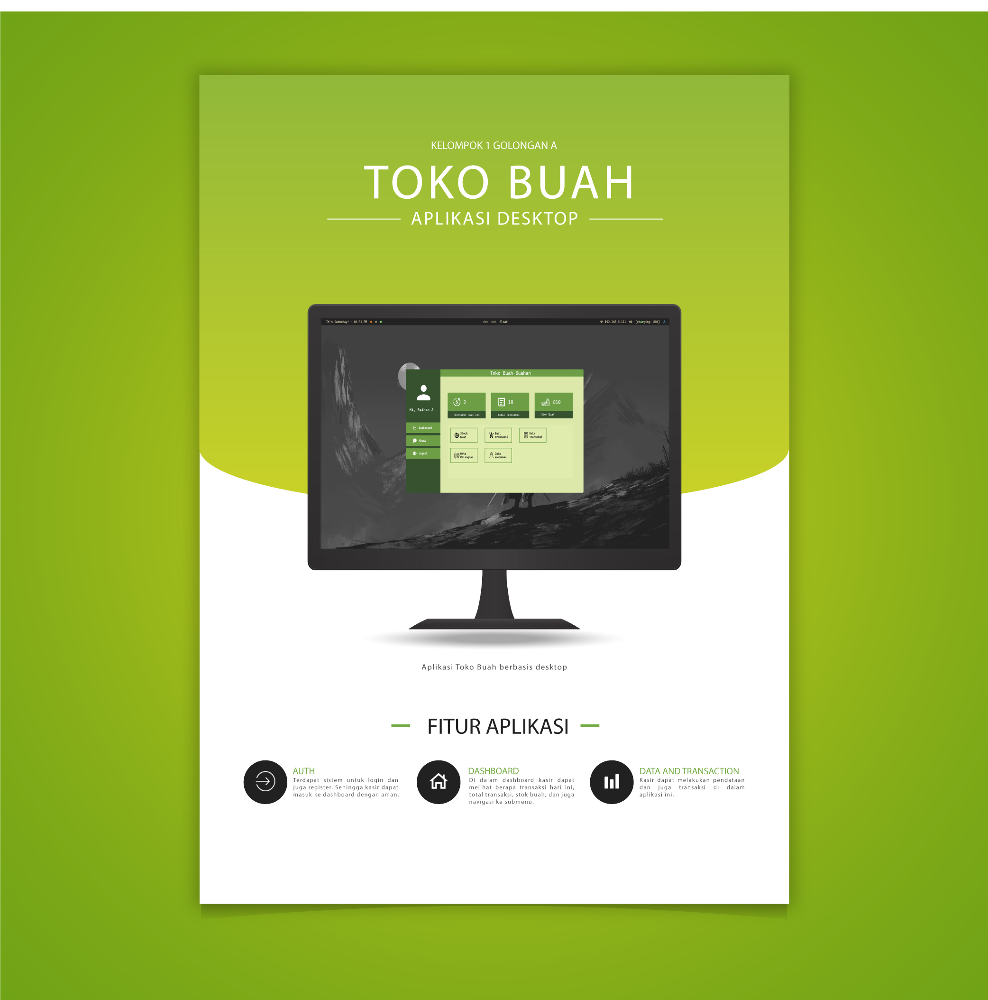

# <h3 align="center">Final Project: Semester 1</h3>

 
> This is main (linux) version. 
 

## Color Palette

1. Black = #191A19 // rgb(25, 26, 25)
2. DarkGreen = #1E5128 // rgb(30, 81, 40)
3. LightGreen = #4E9F3D // rgb(78, 159, 61)
4. WhiteGreen = #D8E9A8 // rgb(216, 233, 168)

## Poster

